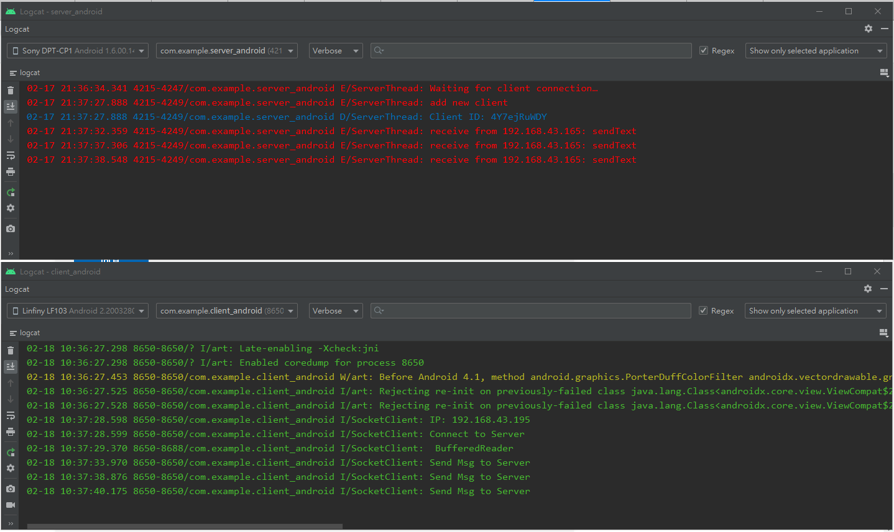
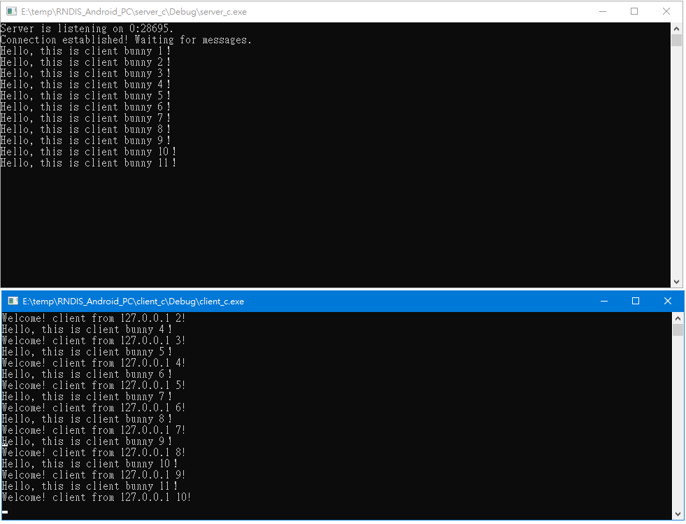
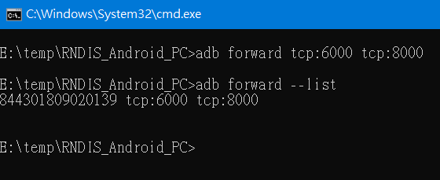
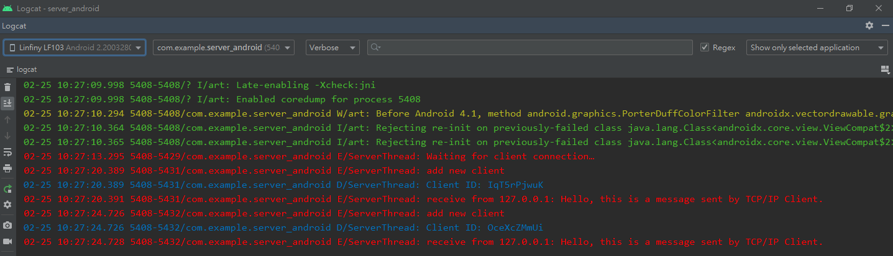

# Socket_PC2Android

Socket TCP/IP for Windows and Android.

## Socket TCP/IP

  
Android

  
* client_android
  
* server_android
  
 <table width="100%" align="center" border="0">
    <tr>
      <td width="50%" align="center"></td>
    </tr>    
 </table> 
  

  
Windows C++

  
* client_c
  
* server_c

* serverThread_c
  
 <table width="100%" align="center" border="0">
    <tr>
      <td width="50%" align="center"></td>
    </tr>    
 </table> 
  

## ADB Forward Method (Wired version)

  
ADB Forward Method 

  
* adbClient_java
  
* server_android
  
  <table width="100%" align="center" border="0">
    <tr>
      <td width="50%" align="center"></td>
      <td width="50%" align="center"></td>
    </tr>    
  </table>
  

